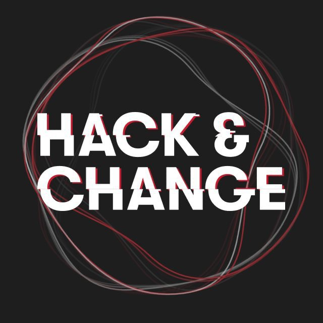

# HackChange Hack
Hack & Change от Changellenge >> — первый хакатон, сосредоточенный на процессе. На твой профессиональный рост повлияет не результат соревнования, а то, чему ты научишься за время участия.

Начни карьеру в веб-разработке и дата-аналитике — реши реальную бизнес-задачу и добавь кейс в портфолио, чтобы выделиться среди других кандидатов.
<div align="center">
    
</div>

## Fast Run
```commandline
docker-compose up -d
```

## Cloning
```commandline
git clone https://github.com/allelleo/ChangeHackBackend.git
```

***
## Project
```commandline
poetry install
poetry run uvicorn app:app
```
***
## Aerich
### Init
```commandline
aerich init -t hack_change_backend.core.config.TORTOISE_ORM
```

### Init DataBase
```commandline
aerich init-db
```
***
## Config
```python
MODE: Literal["dev", "prod"] = "dev" # менять мод на prod для прода
# при dev моде - некоторые функции отключены, включено заполнение бд данными

# App
APP_TITLE = "HackChange" # Меняет название приложение - отображение в Swagger
APP_VERSION = "0.0.1 (beta)" # меняет версию приложения - отображение в Swagger
APP_DESCRIPTION = "Backend service for HackChange hackathon" # меняет описание приложение - отображение в Swagger

DATABASE_URL = "sqlite://database.db" # меняет строку подключения к бд, можно заменить бд на postgresql / mysql поменяв эту строку

# Auth
SECRET_KEY = "123"  #! change in production # Секретный ключ для генерации JWT токена - поменять на проде на что-то более серьезное
ALGORITHM = "HS256"
ACCESS_TOKEN_EXPIRE_MINUTES = 60 * 24 * 30  # Minutes
PLATFORM_KEYS = ["123"] # Ключи для регистрации

```
***
### Stack
Используемый технологии / фреймворки / библиотеки
* #### Python - язык разработки backend
* #### Tortoise-orm - ORM для базы данных ( бд - sqlite3, но в пару кликов можно заменить на postgresql или mysql )
* #### FastAPI - основной фреймворк backend
* #### Uvicorn - отвечает за старт WEB-сервера